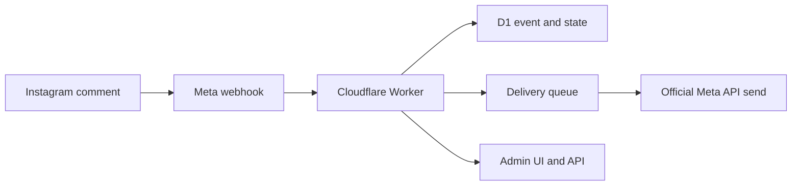

# IG AutoDM Worker

Self-hosted Instagram comment-to-DM automation on Cloudflare Workers using the official Meta Instagram API.

This project is a single-account template for creators and small operators who want to own their infrastructure instead of giving a third-party SaaS direct access to Instagram audience workflows.

## What It Does

- Watches configured Instagram media IDs for configured comment keywords.
- Records Meta webhooks in Cloudflare D1 with idempotency.
- Queues an opening private reply with a postback button.
- Sends an optional public comment reply after the opening delivery is marked sent.
- Sends the final prompt or link only after user interaction by default.
- Supports a browser admin console at `/admin-ui`.
- Refreshes long-lived Instagram tokens and stores refreshed tokens encrypted in D1.
- Keeps a global `AUTOMATION_ENABLED` kill switch.



## Safety Scope

This repository intentionally uses only the official Meta API. It does not use Instagram passwords, session cookies, scraping, browser automation, Selenium, mobile session replay, or unofficial private APIs.

The default flow is narrow:

1. A user comments a configured keyword on a configured media ID.
2. A signed Meta webhook or fallback poller records the event.
3. The Worker queues an opening private reply.
4. Optional public comment reply is queued only after the opening send succeeds.
5. The final prompt normally waits for a button postback or matching text.

`AUTO_FINAL_AFTER_OPENING=true` exists for fallback-heavy environments, but it should stay off for safer App Review behavior.

## Quick Start

```bash
npm install
cp .dev.vars.example .dev.vars
cp wrangler.example.toml wrangler.toml
npm run db:migrate:local
npm run dev
```

Then check:

```bash
curl http://localhost:8787/health
```

Admin console:

```text
http://localhost:8787/admin-ui
```

## Cloudflare Setup

```bash
npx wrangler d1 create ig-autodm-worker
npx wrangler queues create ig-autodm-deliveries
npx wrangler queues create ig-autodm-deliveries-dlq
```

Copy the generated D1 database ID into your local `wrangler.toml`, then configure Worker secrets:

```bash
npx wrangler secret put META_APP_SECRET
npx wrangler secret put META_VERIFY_TOKEN
npx wrangler secret put INSTAGRAM_ACCESS_TOKEN
npx wrangler secret put INSTAGRAM_ACCOUNT_ID
npx wrangler secret put ADMIN_TOKEN
npx wrangler secret put ADMIN_LOGIN_USERNAME
npx wrangler secret put ADMIN_LOGIN_PASSWORD
npx wrangler secret put AUTOMATION_ENABLED
npx wrangler secret put TOKEN_ENCRYPTION_KEY
```

Optional:

```bash
npx wrangler secret put INSTAGRAM_APP_SECRET
npx wrangler secret put TURNSTILE_SECRET_KEY
npx wrangler secret put TURNSTILE_SITE_KEY
npx wrangler secret put META_SENDS_PER_MINUTE
npx wrangler secret put AUTO_FINAL_AFTER_OPENING
```

## Verification

Run before deploying or opening a PR:

```bash
npm run typecheck
npm test
npm audit --json
npm run scan:oss
git diff --check
```

## Deploy

```bash
npm run db:migrate:remote
npm run deploy
```

After deploy, your Worker URL will look like:

```text
https://<worker-name>.<cloudflare-account>.workers.dev
```

Use this shape in the Meta dashboard:

```text
https://<worker-name>.<cloudflare-account>.workers.dev/webhooks/meta
```

## Documentation

- [Product Requirements](docs/01-prd.md)
- [Requirements](docs/02-requirements.md)
- [Architecture](docs/03-architecture.md)
- [Security and Compliance](docs/04-security-and-compliance.md)
- [Meta App Review Playbook](docs/05-meta-app-review-playbook.md)
- [Cost and Operations](docs/06-cost-and-ops.md)
- [Roadmap](docs/07-roadmap.md)
- [API Reference](docs/09-api-reference.md)
- [Feature Matrix](docs/10-feature-matrix.md)
- [Runbook](docs/runbook.md)

## License

MIT.
