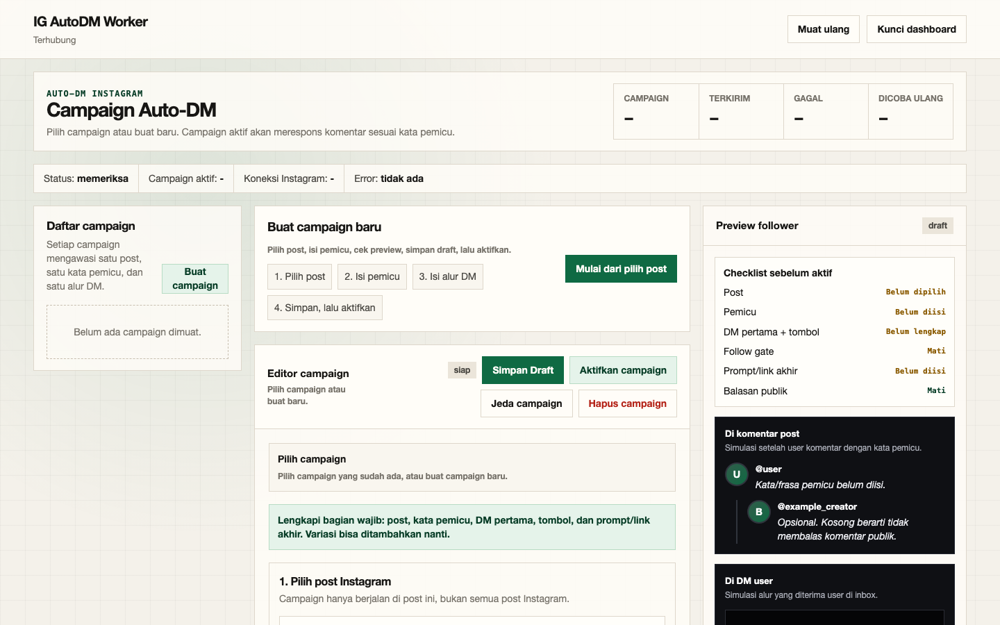
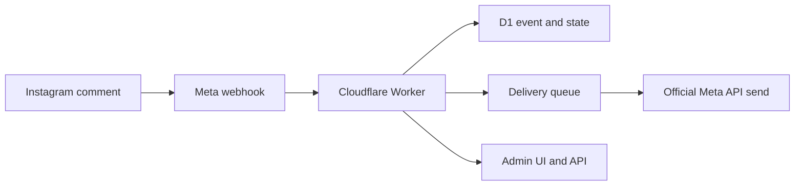

# IG AutoDM Worker

[](https://github.com/aldoprianandi/ig-autodm-worker/actions/workflows/ci.yml)
[](LICENSE)
[](https://workers.cloudflare.com/)
[](docs/04-security-and-compliance.md)

Self-hosted Instagram comment-to-DM automation on Cloudflare Workers using the official Meta Instagram API.

This project is a single-account template for creators and small operators who want to own their infrastructure instead of giving a third-party SaaS direct access to Instagram audience workflows. "Comment a keyword, get the link in your DM" — without renting it.



## What It Does

- Watches configured Instagram media IDs for configured comment keywords, with typo-tolerant fuzzy matching (Damerau-Levenshtein; multi-word keywords require every token in any order).
- Records Meta webhooks in Cloudflare D1 with idempotency, plus a cron poller that catches missed webhooks.
- Queues an opening private reply with a postback button; the flow engine also supports chained DM button steps where each step and the final delivery require user interaction (multi-step saves stay locked off in this template for App Review-grade behavior).
- Rotates message variants deterministically per user (opening, public reply, and each DM step), backed by a reusable searchable template library.
- Sends an optional public comment reply after the opening delivery is marked sent, and an optional public rescue reply when the DM cannot be delivered.
- Supports an optional follow gate: the final prompt waits until the user follows the account, with a retry button and `READY` text fallback.
- Sends the final prompt or link only after user interaction by default.
- Ships a browser admin console at `/admin-ui` with a guided campaign builder, live Instagram-style preview, readiness checklist, and operational dashboard.
- Refreshes long-lived Instagram tokens on a schedule and stores refreshed tokens AES-GCM-encrypted in D1.
- Keeps a global `AUTOMATION_ENABLED` kill switch and a local outbound send rate limiter.
- Does not ship an OAuth callback route; the single-account setup uses a Meta-generated Instagram token.



## Safety Scope

This repository intentionally uses only the official Meta API. It does not use Instagram passwords, session cookies, scraping, browser automation, Selenium, mobile session replay, or unofficial private APIs.

The default flow is narrow:

1. A user comments a configured keyword on a configured media ID.
2. A signed Meta webhook or fallback poller records the event.
3. The Worker queues an opening private reply.
4. Optional public comment reply is queued only after the opening send succeeds.
5. The final prompt normally waits for a button postback or matching text.

`AUTO_FINAL_AFTER_OPENING=true` exists for fallback-heavy environments, but it should stay off for safer App Review behavior.

## Quick Start

Prerequisites:

- Node.js 22 or newer.
- npm 11.8.0 or compatible.
- A Cloudflare account with Wrangler authenticated before remote deploy.
- A Meta developer app with Instagram API access for a Business or Creator test account.

```bash
npm install
cp .dev.vars.example .dev.vars
cp wrangler.example.toml wrangler.toml
npm run doctor
npm run db:migrate:local
npm run dev
```

Edit the copied files before running the doctor. The doctor is an offline, read-only check: it reports key names and setup status without printing values, contacting Cloudflare or Meta, migrating data, or deploying.

Then check:

```bash
curl http://localhost:8787/health
```

Admin console:

```text
http://localhost:8787/admin-ui
```

## Cloudflare Setup

```bash
npx wrangler d1 create ig-autodm-worker
npx wrangler queues create ig-autodm-deliveries
npx wrangler queues create ig-autodm-deliveries-dlq
```

Copy the generated D1 database ID into your local `wrangler.toml`, then configure Worker secrets:

```bash
npx wrangler secret put META_APP_SECRET
npx wrangler secret put META_VERIFY_TOKEN
npx wrangler secret put INSTAGRAM_ACCESS_TOKEN
npx wrangler secret put INSTAGRAM_ACCOUNT_ID
npx wrangler secret put ADMIN_TOKEN
npx wrangler secret put ADMIN_LOGIN_USERNAME
npx wrangler secret put ADMIN_LOGIN_PASSWORD
npx wrangler secret put AUTOMATION_ENABLED
npx wrangler secret put TOKEN_ENCRYPTION_KEY
```

Optional:

```bash
npx wrangler secret put INSTAGRAM_MESSAGING_ACCOUNT_IDS
npx wrangler secret put INSTAGRAM_APP_SECRET
npx wrangler secret put TURNSTILE_SECRET_KEY
npx wrangler secret put TURNSTILE_SITE_KEY
npx wrangler secret put META_SENDS_PER_MINUTE
npx wrangler secret put AUTO_FINAL_AFTER_OPENING
```

Get `INSTAGRAM_ACCESS_TOKEN` from the Meta App Dashboard for the connected Instagram Business or Creator test account. To find `INSTAGRAM_ACCOUNT_ID`, call `/me` with that token and use the returned `user_id`:

```bash
read -r -s IG_ACCESS_TOKEN
curl -H "Authorization: Bearer ${IG_ACCESS_TOKEN}" \
  "https://graph.instagram.com/v25.0/me?fields=user_id,username"
unset IG_ACCESS_TOKEN
```

`INSTAGRAM_MESSAGING_ACCOUNT_IDS` is optional. Leave it unset unless real messaging webhooks show an entry or recipient ID that differs from `INSTAGRAM_ACCOUNT_ID`; if needed, store a comma-separated placeholder-safe list of allowed IDs.

## Verification

Run before deploying or opening a PR:

```bash
npm run typecheck
npm run infra:validate
npm run test:coverage
npm audit --json
npm audit signatures
npm run scan:oss
git diff --check
```

## Deploy

```bash
npm run db:migrate:remote
npm run deploy
```

After deploy, your Worker URL will look like:

```text
https://<worker-name>.<cloudflare-account>.workers.dev
```

Use this shape in the Meta dashboard:

```text
https://<worker-name>.<cloudflare-account>.workers.dev/webhooks/meta
```

Keep `AUTOMATION_ENABLED=false` for the first deploy. After health, webhook verification, admin login, and one disabled/draft campaign are verified, set it to `true` and enable only the test campaign for the first end-to-end run.

## Why Self-Host

SaaS comment-to-DM tools sit between your Instagram account and your audience: they hold your access token, your contact data, and your monthly bill. This template runs the same workflow on your own Cloudflare account — typically within the free tier — with HMAC-verified webhooks, encrypted token storage, rate-limited sends, and an auditable admin surface you fully control.

If this replaces a subscription for you, a star helps other creators find it.

## Feedback and Support

- Use [GitHub Discussions](https://github.com/aldoprianandi/ig-autodm-worker/discussions) for setup questions, ideas, and self-host showcases.
- Use [GitHub Issues](https://github.com/aldoprianandi/ig-autodm-worker/issues) for reproducible bugs and documentation gaps.
- Read the [Support Guide](SUPPORT.md) before sharing diagnostics. Never post tokens, account IDs, live media IDs, or deployment details.

## Documentation

- [Product Requirements](docs/01-prd.md)
- [Requirements](docs/02-requirements.md)
- [Architecture](docs/03-architecture.md)
- [Security and Compliance](docs/04-security-and-compliance.md)
- [Meta App Review Playbook](docs/05-meta-app-review-playbook.md)
- [Cost and Operations](docs/06-cost-and-ops.md)
- [Roadmap](docs/07-roadmap.md)
- [API Reference](docs/09-api-reference.md)
- [Feature Matrix](docs/10-feature-matrix.md)
- [Runbook](docs/runbook.md)
- [Changelog](CHANGELOG.md)
- [Contributing](CONTRIBUTING.md)
- [Support](SUPPORT.md)
- [Security Policy](SECURITY.md)
- [Code of Conduct](CODE_OF_CONDUCT.md)

## License

MIT.
