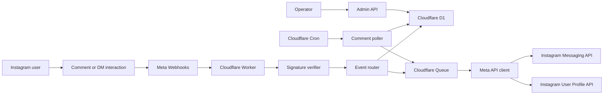
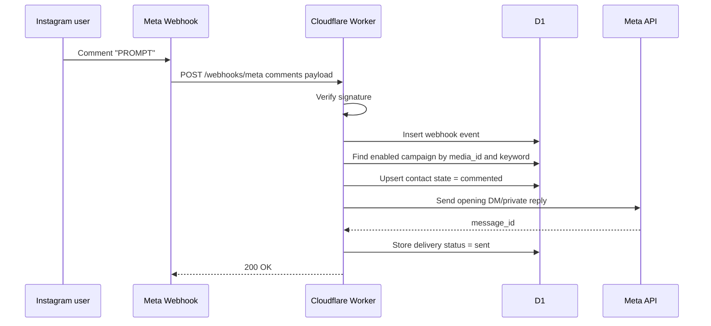
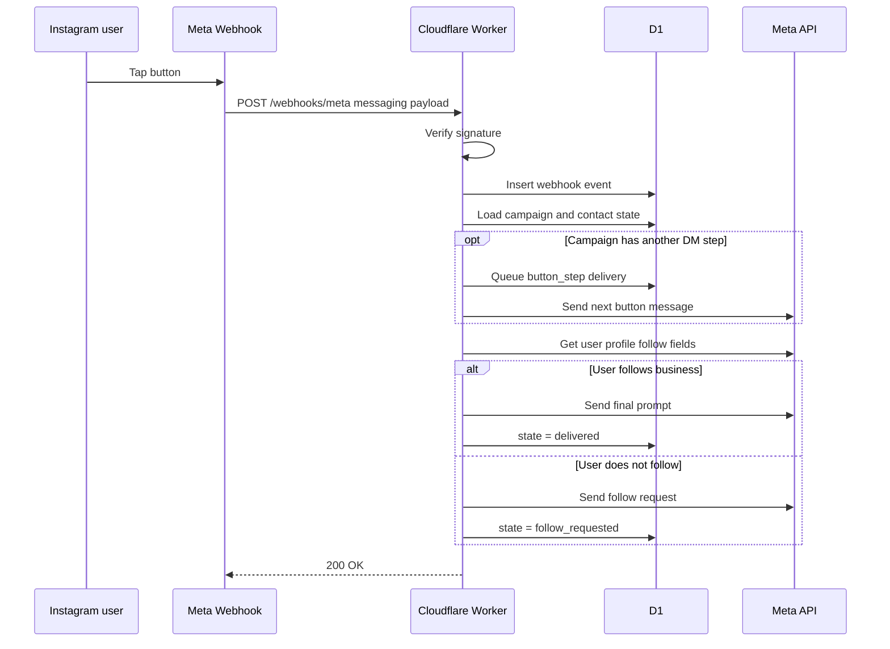
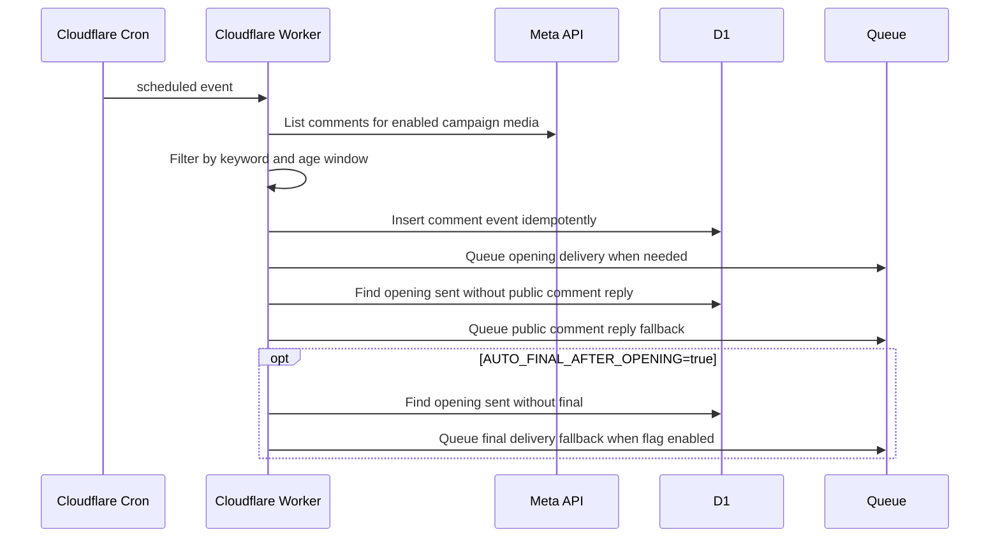

# Architecture

## High-Level System

## Tech Stack

- Runtime: Cloudflare Workers.
- Language: TypeScript.
- Router: Hono or minimal Worker request router. Hono is preferred for clarity.
- Database: Cloudflare D1.
- Queue: Cloudflare Queues for retryable sends.
- Cron: Cloudflare scheduled trigger every minute for fallback polling and final delivery.
- Secrets: Cloudflare Worker secrets.
- Tests: Vitest with Miniflare-compatible unit tests.
- Optional AI: not enabled in the public template; future feature flag only.

## Component Responsibilities

### `src/index.ts`

Entrypoint. Registers routes:

- `GET /health`
- `GET /webhooks/meta`
- `POST /webhooks/meta`
- `GET /admin/campaigns`
- `POST /admin/campaigns`
- `PATCH /admin/campaigns/:id`
- `DELETE /admin/campaigns/:id`
- `GET /admin/media`
- `GET /admin/media/:mediaId/comments`
- `GET /admin/subscription`
- `POST /admin/subscription`
- `GET /admin/audit-logs`

Also exports:

- `queue`: Cloudflare Queue consumer.
- `scheduled`: one-minute cron handler.

### `src/security/signature.ts`

Verifies Meta `X-Hub-Signature-256` using HMAC SHA-256 and the raw request body.

### `src/meta/webhook.ts`

Parses Meta webhook payloads into normalized internal events:

- `comment.created`
- `message.postback`
- `message.quick_reply`
- `message.text`

### `src/meta/api.ts`

Owns all outbound Meta API calls:

- send private reply or message.
- send public comment replies.
- send button template.
- get user profile fields including `is_user_follow_business`.
- list recent media comments for fallback polling.
- pass Instagram tokens through `Authorization` headers.

### `src/security/redaction.ts`

Redacts token-like strings from upstream error text before responses or storage.

### `src/flows/router.ts`

Campaign and state engine:

- match comment to campaign.
- create or update contact state.
- decide delivery action.
- prevent duplicate delivery.

### `src/db/repository.ts`

D1 access layer. Keeps SQL centralized and testable.

### `src/admin/routes.ts`

Operator API for campaign management and operational checks. Protected by `ADMIN_TOKEN`, rate limited before token comparison, and audit logged.

### `src/queue/consumer.ts`

Processes queued delivery jobs and retries transient Meta failures.

### `src/poller/comments.ts`

Scheduled fallback:

- list latest comments for enabled campaign media.
- route matching comments through the same event router used by webhooks.
- skip comments outside the private reply window.
- queue public comment replies when opening delivery is already `sent` and no public reply delivery exists.
- queue final deliveries only when `AUTO_FINAL_AFTER_OPENING=true` and opening delivery is already `sent` with no final delivery.

## Request Flow: Comment Trigger

## Request Flow: Button Confirmation

## Request Flow: Fallback Comment Polling

## Deployment Shape

Initial deployment:

- One Worker project.
- One D1 database.
- One Queue.
- One Meta app.
- One Instagram account token stored as Worker secret.
- One scheduled cron trigger.

Future deployment:

- OAuth installation flow for multiple owned accounts.
- Encrypted token storage per account.
- Dedicated admin UI.

## Key Design Decisions

### Decision 1: Official Meta API Only

Reason: account safety and reviewability matter more than saving a few hours.

### Decision 2: Single Account First

Reason: multi-account support adds OAuth, tenant isolation, billing, token vaulting, and support obligations. None of that is needed to validate the funnel.

### Decision 3: Static Delivery First

Reason: comment-to-DM lead magnet flows do not need AI for the core value. AI can be added after the funnel proves useful.

### Decision 4: D1 Over KV for State

Reason: relational uniqueness constraints are useful for idempotency and delivery records. KV can still be used later for hot campaign config caching.

### Decision 5: Queue for Outbound Sends

Reason: Meta can retry webhooks if the backend is slow. Accept quickly, store intent, and send through a retryable path.

### Decision 6: Fallback Final Delivery

Reason: Meta message webhooks can be delayed or unavailable during setup. Single-step campaigns can optionally queue final content after an opening delivery is confirmed sent, but this fallback is disabled by default so App Review demos remain user-triggered.

### Decision 7: Public Comment Reply After Opening

Reason: many comment-to-DM flows use a visible comment-thread acknowledgement such as `Sent. Check your DM.`. The Worker queues this only after the opening private reply is marked `sent`, and the `comment_reply` delivery key prevents repeated replies to the same campaign/user pair.
